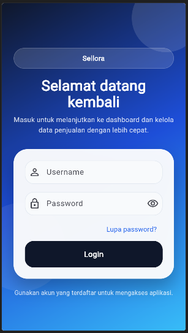
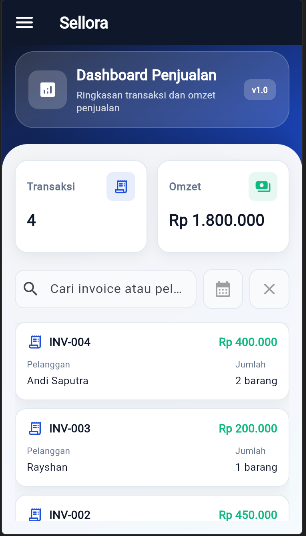
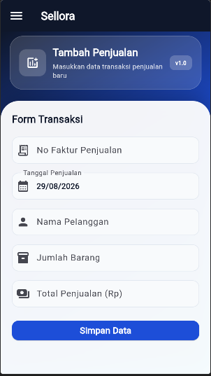
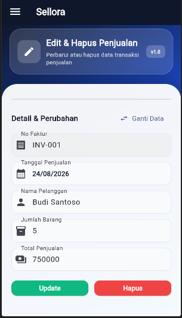

# 🛍️ Sellora

**Aplikasi manajemen penjualan berbasis Flutter, Node.js, Express, dan MongoDB.**

Sellora adalah aplikasi full-stack untuk membantu pengguna mencatat dan mengelola transaksi penjualan secara terstruktur. Aplikasi ini menggunakan Flutter sebagai frontend, REST API berbasis Node.js dan Express sebagai backend, serta MongoDB untuk menyimpan data.

## ✨ Fitur Utama

### Autentikasi

- Registrasi pengguna.
- Login menggunakan JWT authentication.
- Sesi login tetap tersimpan menggunakan `shared_preferences`.
- Logout dengan konfirmasi.
- Endpoint API penjualan terlindungi oleh token JWT.

### Dashboard

- Setelah login, pengguna langsung diarahkan ke dashboard.
- Menampilkan jumlah transaksi dan total omzet.
- Tabel seluruh transaksi penjualan.
- Pencarian berdasarkan nomor faktur atau nama pelanggan.
- Filter transaksi berdasarkan tanggal.
- Data dashboard diperbarui setelah transaksi ditambah, diubah, atau dihapus.

### Manajemen Penjualan

- Menambahkan transaksi baru.
- Memilih transaksi untuk diedit.
- Mengubah tanggal, pelanggan, jumlah barang, dan total penjualan.
- Menghapus transaksi dari halaman edit dengan konfirmasi.
- Validasi form, indikator loading, dan notifikasi hasil operasi.

## 🧭 Alur Penggunaan

```text
Login
	│
	▼
Dashboard utama
	├── Dashboard: statistik, pencarian, filter, dan tabel
	├── Tambah Penjualan: membuat transaksi baru
	├── Edit Penjualan: memilih, mengubah, atau menghapus transaksi
	└── Logout
```

Sidebar dapat dibuka melalui tombol menu di bagian kiri atas. Menu sidebar yang tersedia adalah `Dashboard`, `Tambah Penjualan`, `Edit Penjualan`, dan `Logout`.

## 🛠️ Teknologi

| Bagian            | Teknologi          |
| ----------------- | ------------------ |
| Frontend          | Flutter            |
| Backend           | Node.js + Express  |
| Database          | MongoDB            |
| Autentikasi       | JWT                |
| State management  | Stateful Widget    |
| Komunikasi API    | HTTP Package       |
| Penyimpanan token | Shared Preferences |

## 📁 Struktur Project

```text
Sellora/
├── frontend/                 # Aplikasi Flutter
│   ├── lib/
│   │   ├── models/           # Model data penjualan
│   │   ├── screens/           # Halaman login dan dashboard
│   │   ├── services/          # AuthService dan SalesService
│   │   ├── storage/           # Penyimpanan token
│   │   ├── theme/             # Tema dan design system
│   │   └── widgets/           # Sidebar dan komponen reusable
│   ├── pubspec.yaml
│   └── test/
│
├── backend/                  # REST API Node.js
│   ├── config/                # Konfigurasi database
│   ├── controllers/           # Logika autentikasi dan penjualan
│   ├── middleware/            # Middleware autentikasi
│   ├── models/                # Model MongoDB
│   ├── routes/                # Route API
│   ├── server.js
│   └── package.json
│
├── LICENSE
└── README.md
```

## 🚀 Instalasi dan Menjalankan Project

### Prasyarat

Pastikan perangkat sudah memiliki:

- Node.js dan npm.
- Flutter SDK.
- MongoDB lokal atau MongoDB Atlas.
- Browser Chrome untuk menjalankan frontend versi web, atau emulator/perangkat Flutter.

### 1. Clone repository

```bash
git clone https://github.com/Rayshan10/Sellora.git
cd Sellora
```

### 2. Menjalankan backend

```bash
cd backend
npm install
```

Buat file `.env` di dalam folder `backend`:

```env
PORT=5000
MONGO_URI=mongodb://127.0.0.1:27017/sellora
JWT_SECRET=ganti_dengan_secret_key_yang_aman
```

Jalankan backend dalam mode development:

```bash
npm run dev
```

Atau jalankan tanpa `nodemon`:

```bash
npm start
```

Backend tersedia di `http://localhost:5000`.

### 3. Menjalankan frontend

Buka terminal baru dari folder utama project:

```bash
cd frontend
flutter pub get
flutter run -d chrome
```

Untuk menjalankan pada perangkat atau emulator yang terhubung:

```bash
flutter devices
flutter run -d <device-id>
```

> Untuk koneksi lokal pada Android emulator, `localhost` biasanya perlu diganti menjadi `10.0.2.2` pada file service Flutter. Pada web dan Windows desktop, `localhost` dapat digunakan secara langsung.

## 🗄️ Database

Nama database default:

```text
sellora
```

Collection yang digunakan:

```text
users
sales
```

Data transaksi pada collection `sales` memiliki informasi nomor faktur, tanggal penjualan, nama pelanggan, jumlah barang, dan total penjualan.

## 🔐 Alur Autentikasi

```text
User login
	│
	▼
POST /api/auth/login
	│
	▼
JWT disimpan di shared_preferences
	│
	▼
Token dikirim pada Authorization header
	│
	▼
Backend memverifikasi token
	│
	▼
API penjualan dapat diakses
```

## 🌐 REST API

### Autentikasi

| Method | Endpoint             | Keterangan                                |
| ------ | -------------------- | ----------------------------------------- |
| `POST` | `/api/auth/register` | Mendaftarkan pengguna baru                |
| `POST` | `/api/auth/login`    | Login dan mendapatkan JWT                 |
| `GET`  | `/api/auth/me`       | Mengambil data pengguna yang sedang login |

### Penjualan

Seluruh endpoint berikut membutuhkan header:

```http
Authorization: Bearer <jwt-token>
```

| Method   | Endpoint         | Keterangan                         |
| -------- | ---------------- | ---------------------------------- |
| `GET`    | `/api/sales`     | Mengambil seluruh transaksi        |
| `POST`   | `/api/sales`     | Menambahkan transaksi              |
| `PUT`    | `/api/sales/:id` | Mengubah transaksi berdasarkan ID  |
| `DELETE` | `/api/sales/:id` | Menghapus transaksi berdasarkan ID |

## 🧪 Validasi Project

Untuk memeriksa kode Flutter:

```bash
cd frontend
flutter analyze
flutter test
```

Skenario utama yang perlu diuji:

- Registrasi dan login pengguna.
- Sesi tetap tersimpan setelah aplikasi dibuka kembali.
- Dashboard memuat statistik dan tabel penjualan.
- Pencarian dan filter tanggal.
- Tambah transaksi dan memastikan data langsung muncul di dashboard serta halaman edit.
- Edit transaksi.
- Hapus transaksi dan memastikan form kembali ke daftar transaksi.
- Logout dan kembali ke halaman login.

## 🖼️ Screenshot Aplikasi

Berikut adalah tampilan utama aplikasi Sellora:

### Halaman Login



### Dashboard



### Tambah Penjualan



### Edit Penjualan



## 🔮 Pengembangan Berikutnya

- Export transaksi ke PDF atau Excel.
- Laporan penjualan bulanan.
- Grafik omzet dan transaksi.
- Manajemen pelanggan dan produk.
- Dark mode.
- Role-based authentication.

## 👨‍💻 Developer

**Rayshan Gani Putra**

Full Stack Developer • Flutter • Node.js • MongoDB

GitHub: <https://github.com/Rayshan10>

## 📄 Lisensi

Project ini menggunakan lisensi MIT. Informasi selengkapnya dapat dilihat pada file [LICENSE](LICENSE).
